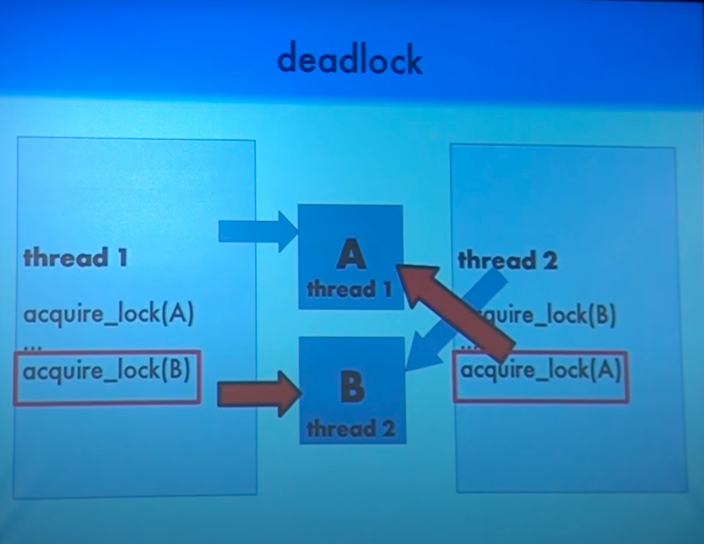

# Deadlock #

Deadlock problem is a situation where two or more threads are blocked forever, waiting for each other.

In above example,

- Thread 1 check whether anyone has acquired lock on resource A ==> no, so it acquires lock on resource A
- Thread 2 check whether anyone has acquired lock on resource B ==> no, so it acquires lock on resource B
- Thread 1 check whether anyone has acquired lock on resource B ==> yes, so it waits for Thread 2 to release lock on
  resource B
- Thread 2 check whether anyone has acquired lock on resource A ==> yes, so it waits for Thread 1 to release lock on
  resource A
  Now both threads are waiting for each other to release the lock, so this is a deadlock situation.

## Reasons for Deadlock ##

- **Mutual Exclusion** : When two people meet in the landings, they can’t just walk through because there is space only
  for one person. This condition allows only one person (or process) to use the step between them (or the resource) is
  the first condition necessary for the occurrence of the deadlock.

- **Hold and Wait** : When the two people refuse to retreat and hold their ground, it is called holding. This is the
  next necessary condition for deadlock.

- **No Preemption** : For resolving the deadlock one can simply cancel one of the processes for other to continue. But
  the Operating System does not do so. It allocates the resources to the processors for as much time as is needed until
  the task is completed. Hence, there is no temporary reallocation of the resources. It is the third condition for
  deadlock.

- **Circular Wait** : When the two people refuse to retreat and wait for each other to retreat so that they can complete
  their task, it is called circular wait. It is the last condition for deadlock to occur.

**Note: All four conditions are necessary for deadlock to occur. If any single one is prevented or resolved, the
deadlock is resolved.**