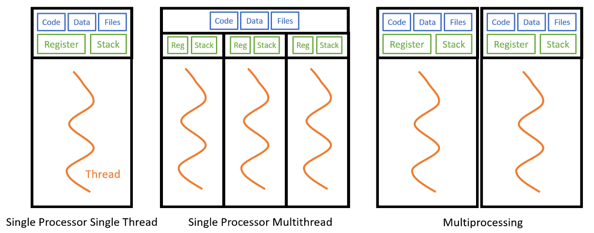
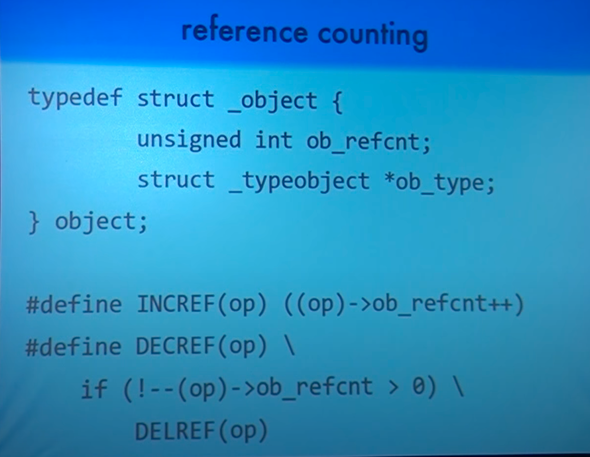
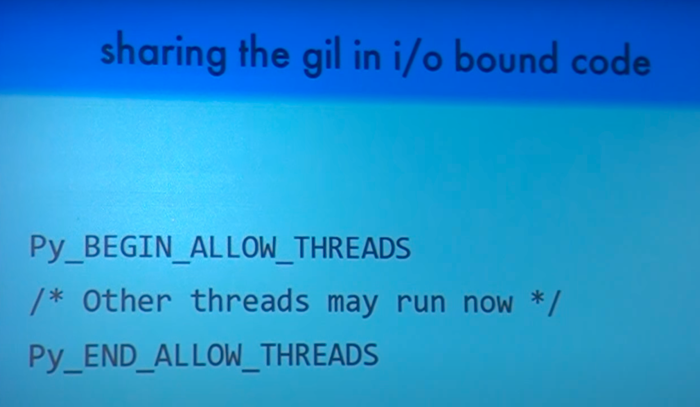

## Introduction ##

Multithreading and multiprocessing are two ways to achieve multitasking (think distributed computing!) in Python.
Multitasking is useful in running functions and code in parallel, such as breaking down mathematical computation into
multiple smaller parts, or splitting items in a for-loop if they are independent of each other

# Multithreading vs. Multiprocessing #

By formal definition, **multithreading** refers to the ability of a processor to execute multiple threads concurrently (
It is called **Concurrency**), where each thread runs a process. Whereas **multiprocessing** refers to the ability of a
system to run multiple processors concurrently (It is called **Parallelism**) , where each processor can run one or more
threads.



- **Multithreading** is useful for IO-bound processes, such as reading files/data stream from internet or database,
  reading files and directories on your computer since each thread can run the IO-bound process concurrently.

- **Multiprocessing** is useful for CPU-bound processes, such as computationally heavy tasks since it will benefit from
  having multiple processors; similar to how multicore computers work faster than computers with a single core.

- **Multithreading** for CPU-bound processes might slow down performance due to competing resources that
  ensure only one thread can execute at a time, and overhead is incurred in dealing with multiple threads. The reason
  for this is that Python has the Global Interpreter Lock (GIL) that basically makes all threads run inside one
  master thread. Because of this, when you go to run multiple CPU intensive operations with threads, you may find that
  it actually runs slower than a normal process. So we will be focusing on what threads do best: I/O operations!

- On the other hand, **multiprocessing** can be used for IO-bound processes. However, overhead for managing multiple
  processes is higher than managing multiple threads as illustrated above. You may notice that multiprocessing might
  lead to higher CPU utilization due to multiple CPU cores being used by the program, which is expected.

---

In Python, all objects and data structures are stored in the private heap and are managed by Python Memory Manager
internally. The goal of the memory manager is to ensure that enough space is available in the private heap for memory
allocation. This is done by deallocating the objects that are not currently being referenced (used). As developers, we
don’t have to worry about it as it will be handled automatically by Python.

# Reference Counting (RC) #

Python uses reference counting to keep track of Lifetime of an object or the number of references(In normal words how
many people are referencing) to an object. When the reference count of an object reaches zero, the object is destroyed
and memory is freed.

- Every Object in Python has to start with below 2 things:
    - **Type** - The type of the object. This is a pointer to the object’s type object.
    - **Reference Count** - The number of references to the object. This is a counter that is incremented whenever the
      object is referenced and decremented whenever the object is dereferenced.

```text
struct object {
    unsigned int ob_refcnt; // Reference Count
    struct _typeobject *ob_type; // Type
} object; 
```

---

```c 
struct object {
    unsigned int ob_refcnt; // Reference Count
    struct _typeobject *ob_type; // Type
} object; 

#define INCREF(op) ((op)->ob_refcnt++) // To increment the reference count
#define DECREF(op) \                  // To decreament the reference count
    if (!--(op)->ob_refcnt > 0) \
        DELREF(op)
```

---

```python
import sys

variable1 = [1, 2]
variable2 = variable1
print(sys.getrefcount(variable1))  # 3 
# Because In Python, by default, variables are passed by reference. Hence, when we run sys.getrefcount(variable1) to get 
# the reference count of variable1, it creates another reference as to variable1. So, keep in mind that it will always 
# return one reference count extra. So in reality reference count to variable1 is 2.
```

Or you can also use ctypes module in python to get the reference count of an object.

```python
import ctypes

var1 = [10, 20]
var2 = var1
print(ctypes.c_long.from_address(id(var1)).value)  # 2 This gives actual count of references to var1
```



---

# Global Interpreter Lock (GIL) #

[](https://www.youtube.com/watch?v=KVKufdTphKs)

- The GIL is a mutex (or a lock) that allows only one thread to hold the control of the Python interpreter. This means
  that only one thread can be in a state of execution at any point in time. This simplifies the CPython interpreter
  design and implementation. The implementation of the GIL is hidden from the developer. The GIL is necessary mainly
  because CPython’s memory management is not thread-safe (i.e. it is not safe to use the same object from multiple
  threads at the same time) and GIL makes sure of thread safety/no deadlock as there is eventually one lock.

- When you actually want to use multiple threads at the same time, you can drop the GIL. This is done by using the C API
  / Macros. The GIL is released when you call a C function that does a blocking operation (e.g. I/O, sleep,
  reading/writing data over internet etc. where CPU is just idle waiting for some response.) and reacquired when the
  blocking operation is finished. Python is very good at dropping the GIL when it is not needed and reacquiring it
  when it is needed which makes it very efficient for I/O bound tasks using multiple threads.
  