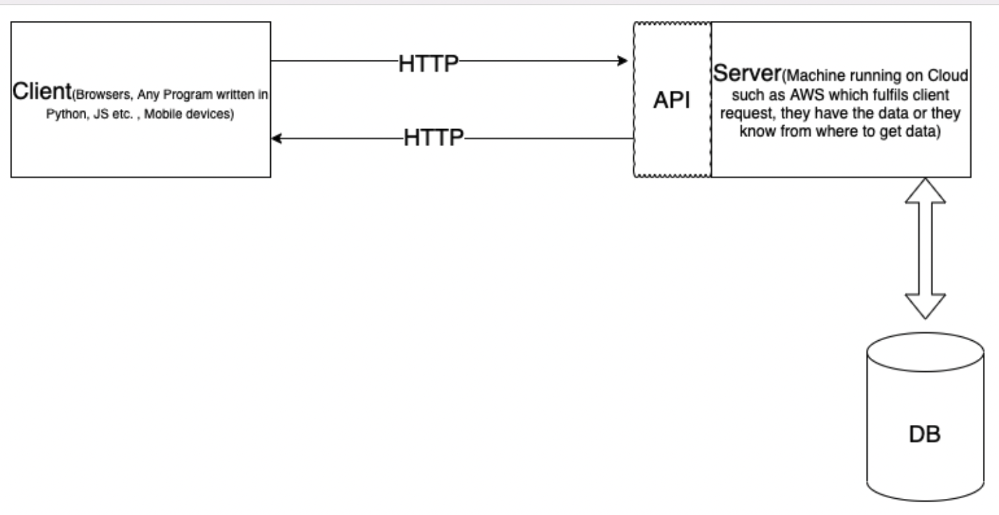
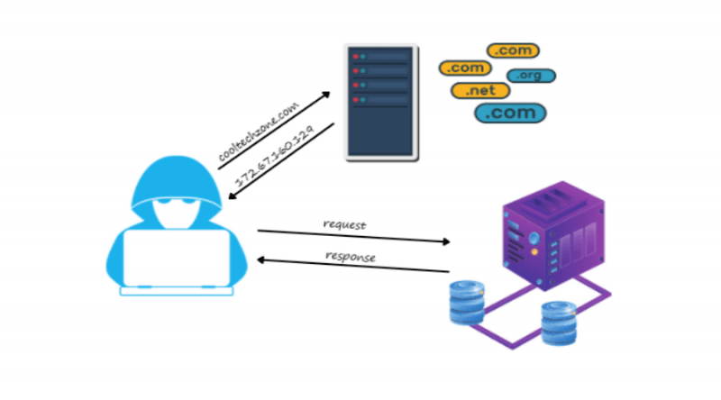

# Client Server Model # 

In simple words a Client-Server model is where a client sends some request to server and server responds to it
accordingly.
**Client :** The one which requests for information (Like Any C++,Java, Python etc. Program, Your IPhone, Mac devices,
Browsers etc. Remember when we say we have a client meeting/or you go to restaurant and order something they say there
is an order for client, meaning you are requesting for something.)

**Server :** The one which responds which appropriate data/Information for request.(Like in restaurant we order
something, they respond with the food : So in that case we are client and restaurant is server)

---

- Client doesn't need to know, how the server is giving it information (Like what operations a server is performing to
  fulfill client request) which it is asking for (It is only concerned about the information.)
- A server/ or there can be multiple servers which can be responsible to fulfill client request.
- Either Server/s contains this information which client is asking for, or they know from where to get that data (Maybe
  that data is present in DB which is present on some other server. Hence, Server talks to Db, fetches data and returns
  to Client).
- Server and client talk to each other on some network protocols (Nowadays mostly HTTP) on some port (HTTP: 80, HTTPS:
  443 etc.) using APIs.

- Human generally interact with each other with names, but computers only understand numbers so fill out that gap
  network engineer come up with a very cool concept of DNS(Learn more about it on DNS in day1.md).
- Using DNS only Clients are able to resolve the IP address of Servers.

