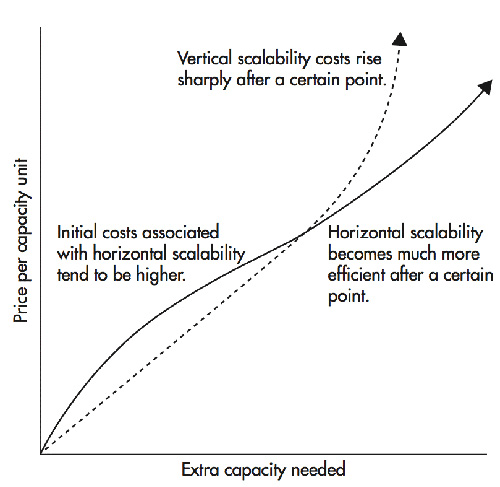

Over the time as number of users in tour application increases, the most important thing for you to provide services to
all users at the same time and for that we need to scale our system according to the usage. There are basically 2 ways
to scale your software:

- Horizontal Scaling
- Vertical Scaling

---

|                                                                                                                                                                                         Horizontal Scaling                                                                                                                                                                                         |                                                                                                                Vertical Scaling                                                                                                                 |
|:--------------------------------------------------------------------------------------------------------------------------------------------------------------------------------------------------------------------------------------------------------------------------------------------------------------------------------------------------------------------------------------------------:|:-----------------------------------------------------------------------------------------------------------------------------------------------------------------------------------------------------------------------------------------------:|
|                                                                                                                                                                                        Adding more machines                                                                                                                                                                                        |                                                                                                       Adding more power to single machine                                                                                                       |
|                                                                                                                                                                                           [] [] [] [] []                                                                                                                                                                                           |                                                                                                                    [      ]                                                                                                                     | 
|                                                                                                                              Load balancing is required so that we can properly use all machine equally and redirect requests to other machines in case of high load.                                                                                                                              |                                                                                                                       N/A                                                                                                                       |
|                                                                                                                                                Resilient(Meaning if one machine fails, control goes to other machine to handle requests of clients)                                                                                                                                                |                                                                                                 Single Point of failure as it is single machine                                                                                                 |
|                                                                                                                                               Slow because Network Calls (As machines are different, they talk to each other on a network protocol)                                                                                                                                                |                                                                                        Fast as Single Machine, there will be inter process Communication                                                                                        | 
|                                                                                                                                                                                            Scales well                                                                                                                                                                                             |                                                                                        Hardware limit (As we can't have a infinite large single machine)                                                                                        |
| Data inconsistency(Since we are passing information from 1 machine to other so we are not sure whether <br/we will get consistent data or not. There can be inconsistency in cache (Dirty read/write). For example let's say we are performing an atomic operation, in that case we have to lock all machine to ensure that everything is successful or rollback (Which is practically impossible) |                                                                                                  Data is consistent as we have single machine                                                                                                   |
|                                                                                            Although it is more costly in the beginning but It is much cheaper over the time as the usage increases, because adding more spec to same machine is more costly than adding new machine with current spec.                                                                                             | Although it is cheaper in the beginning but It is more costly as the time passes and we keep on increasing spec over the time and at a point, it becomes almost impossible to add more specs to a single machine as we reach to MAX CPU, Memory |

---

---

In real life scenario, we basically use combination of both (Hybrid Scaling==> Although we call it horizontal scaling)

- Data Consistency
- Resilient
- Load Balancing
- Inter Process Communication (Fast)