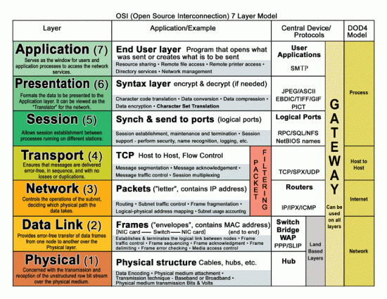

# Proxy vs Reverse Proxy #

**Proxy** is an act which someone does on your behalf(College me proxy lagate the na).Whenever our computer wants to
talk to internet, our request goes through a proxy server, so that any malicious activity can be prevented. It acts as a
firewall.

Client( Intranet) ---------------->   Proxy Server ---------------------->   Server B (Internet)
( It encrypts our request (hide your IP address and sensitive data) so that Server B doesn't know your IP address, plus
it does caching to increase performance so that for same request you don't need to go to internet again and again )

---

**Reverse Proxy** does the same thing which a proxy does but in this time we protect our servers. Let's say you have a
website which you have hosted on internet on some servers, and some users wants to access data available on your
website. It requests to your servers for the same, but you don't want to expose information of your servers to the user
while fulfilling the request.

Users <-------------------> Reverse Proxy <------------------> Multiple Servers
(Reverse Proxy protects our servers(filter requests), compresses request/response data packets to increase performance,
caching. Users don't have any clue about which server is fulfilling the request).

**Note:** Reverse Proxy helps us load balance the requests which means It can also act as load balancer. Although a load
balancer has a specific task to distribute requests among servers while Reverse Proxy does lots of things (like
security, caching etc.)

# Network Address Translation (NAT) #

It is a process to map (one IP address or IP address pairs) to other (IP address or IP address pairs).

# What is Load Balancer (Aka Fault tolerant) #

Load balancer sits between our servers and clients and populates requests among servers based on various criteria using
some algorithms for better performance, makes sure no server is overworked. It takes cares of availability (Basically
checks whether server is up and running or not, if down, it sends request to remaining running servers).
**Note:** These servers are clone of each other, hence it doesn't matter which server is fulfilling our request.

There are two types of load balancer:

1. Layer 4 Load Balancer (Layer 4 of OSI Model==> Transport Layer)
2. Layer 7 Load Balancer (Layer 7 of OSI Model ==> Application Layer)

---

## Layer 4 Load Balancer ##

