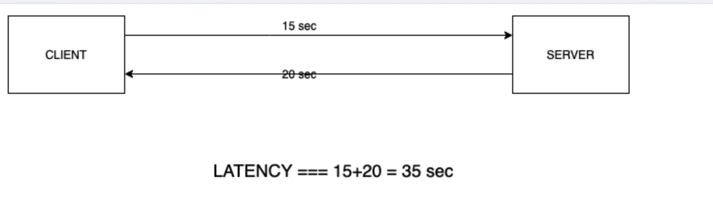

**Latency :-** It is the time taken from client starting the request to client getting the response(when transferring
data over network). You hear speed, ping/delay etc. these generally refer to latency of system.

Similarly, in other context, say you re on machine, and you want to read file data present in machine, that time cycle
can also be referred as latency. Human ask for food, and they get that food, that time cycle can also be referred as
latency.

From the diagram it is clear that, **the lower is latency, the higher the performance**. Below is some latency example (
roughly speaking)  to read 1MB data from:-

1. Memory : 250 microsecond
2. SSD :  1000 microsecond
3. Over 1 GBPS network : 10000 microsecond
4. HDD : 20000 microsecond

If we are sending a packet of 1000 byte from **California ----> Netherlands ---> California** takes 150000 microsecond
roughly speaking. That would be latency.

---

**How does latency work?**

Suppose you interact with an e-commerce website, say, Amazon, and you liked something and added it to the cart. Now when
you press the “Add to Cart” button, the following events will happen:
From that instant the **Add to Cart** button is pressed, the clock for latency starts, and the browser initiate a
request to the server. The server acknowledges the request and processes it. The server replies to the request, and the
request reaches your browser, and the product gets added to your Cart. You can start the stopwatch in 1st step and stop
the stopwatch in the last step, and the diff would be the latency.

---

**Latency** depends on the kind of **System Storage** which we are using(SSD>HDD ==> Speed), distance b/w communication
nodes (client and server) etc.

As a developer, to lower the latency, we can do below things:

1. Avoid unnecessary loops, conditionals, choose programming language which best suits your need.
2. Wisely choose any data structure which you are using for any task.
3. Use asynchronous programming to efficiently utilize the hardware resources.
4. Use caching, keep data in memory.
5. Never over/under utilize your system resources.

---
**Note** Do not make assumption of Latency based on **Throughput** and vice versa.