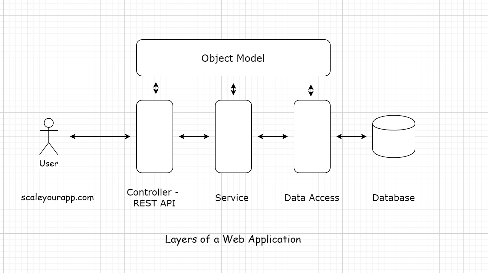

# Tier-N Application #

A tier-n application is a software architecture that has more than three components(UI, business logic / Backend Logic,
and Database).
These components can be:

- Cache
- Message Queues for asynchronous behaviour
- Load Balancers
- Search server for searching through massive data
- Components running heterogeneous tech such as web services, microservices etc.

Almost all the large applications like Instagram, Facebook, Spotify, TikTok, Uber, Airbnb, Pokemon Go etc. are tier-n
applications today.
N-Tier architecture is also called as **Distributed System**.

## Why so many Tiers ##

There are two design principles which are key to explain this.

- **Single Responsibility**: Each component should have a single responsibility. Since components are loosely coupled
  in terms of responsibility, any change in the other component will not affect the other component functionality. For
  example, you upgraded your database server and something went wrong, in that case only database will go down and rest
  services will be unaffected. The application will still run but only features dependent on database will be affected.
  **The single responsibility principle is why I was never a fan of stored procedures. Stored procedures enable us to
  add business logic to the database, which is always a big no. What if, in the future, we want to plug in a different
  database? Where do we take the business logic? Do we take it to the new database? Or do we refactor the application
  code and squeeze in the stored procedure logic somewhere?
  A database should not hold business logic. It should only take care of persisting the data. This is what the single
  responsibility principle is, which is why we have separate tiers for separate components.**

- **Separation of Concerns**: This has same meaning loosely as Single Responsibility, be concerned about your work only
  and stop worrying about the rest of the stuff. These principles act at all the levels of the service, be it the tier
  level or the code level.Keeping the components separate makes them reusable. Different services can use the same
  database, messaging server or any other component as long as they are not tightly coupled with each other. Having
  loosely coupled components is the way to go. This approach enables us to scale our service easily when things
  grow beyond a certain scale in the future.

### Tier vs Layer ###

The difference between layers and tiers is that layers represent the conceptual/logical organization of the code,
whereas tiers represent the physical separation of components.