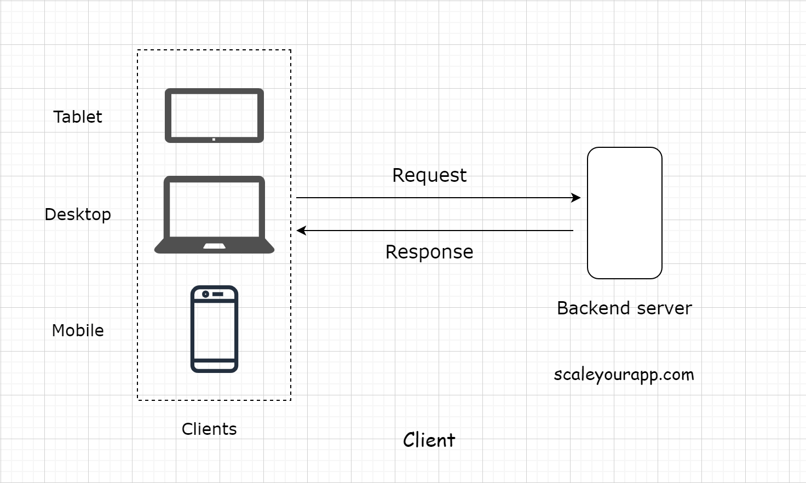
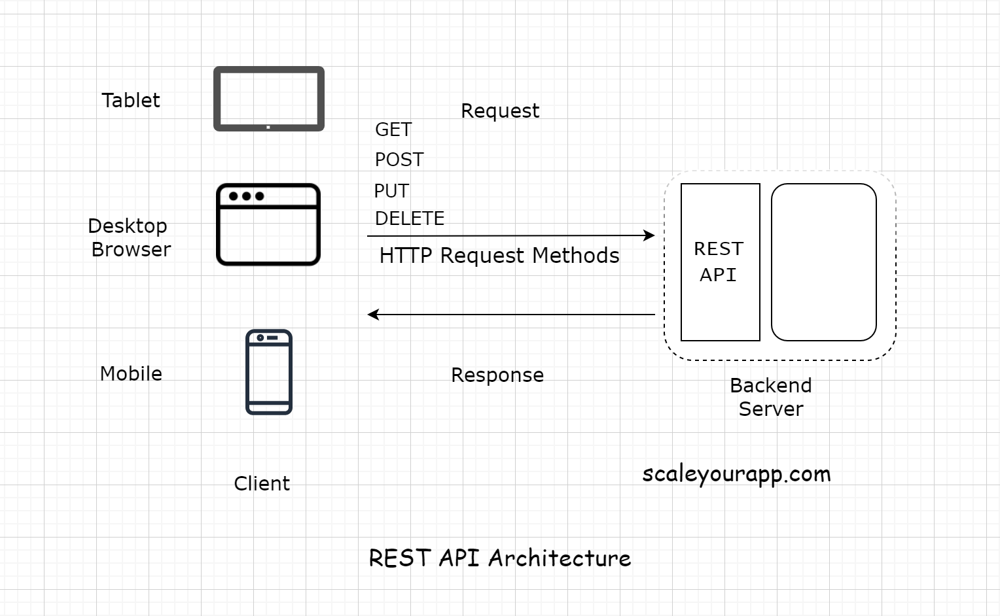

# Client Server Model # 

In simple words a Client-Server model is where a client sends some request to server and server responds to it
accordingly.
**Client :** The one which requests for information (Like Any C++,Java, Python etc. Program, Your IPhone, Mac devices,
Browsers etc. Remember when we say we have a client meeting/or you go to restaurant and order something they say there
is an order for client, meaning you are requesting for something.). The client holds our user interface. The user
interface is the presentation part of the application. It’s usually responsible for the look and feel of the
application.

## Types of Client ##

There are 2 types of clients:

1. **Thin Client** - Contains only the UI and no business logic. For every action, the client sends a request to the
   backend server (Tier-3 or higher).
2. **Thick/Fat Client** - Contains all or some part of the business logic along with UI(Tier-2).

---

**Server :** It receives the requests from the client and responds with appropriate data/Information after executing the
business logic based on the request parameters received from the client.(Like
in restaurant we order something, they respond with the food : So in that case we are client and restaurant is server).

**Request-response model :**
The client and the server have a request-response model. The client sends the request and the server responds with the
data.
If there is no request, there is no response.
Every website you browse, be it a WordPress blog, an application like Facebook, Twitter, or your banking app, is built
on the client-server architecture. There is another architecture called peer-to-peer which we will discuss later.

Every online service needs a server to run. Servers running web applications are commonly known as application servers.
All the components of a web application need a server to run, be it a database, a message queue, a cache, or any other
component. In modern application development, even the user interface is hosted separately on a dedicated server.

---

- Client doesn't need to know, how the server is giving it information (Like what operations a server is performing to
  fulfill client request) which it is asking for (It is only concerned about the information.)
- A server/ or there can be multiple servers which can be responsible to fulfill client request.
- Either Server/s contains this information which client is asking for, or they know from where to get that data (Maybe
  that data is present in DB which is present on some other server. Hence, Server talks to Db, fetches data and returns
  to Client).
- Server and client talk to each other on some network protocols (Nowadays mostly HTTP) on some port (HTTP: 80, HTTPS:
  443 etc.) using APIs.

---

## Server Side Rendering (SSR): ##

Often the developers use a server to render the user interface on the backend and then send the generated data to the
client. This technique is known as server-side rendering. We will learn about is more along with Client Side Rendering
in future tutorials.

## REST API and API Endpoints: ##

Speaking from the context of modern n-tier web applications, every client has to hit a REST endpoint to fetch the data
from the backend. All the data transfer happens over **HTTP Protocol**. REST stands for Representational State Transfer.
REST is a set of rules that defines how the data is stored and retrieved from the backend. The backend application code
has a REST-API implemented. This acts as an interface to the outside world requests. Every request, be it from the
client written by the business or the third-party developers, those who consume our API data have to hit the REST
endpoints to fetch the data.

# Real world example of using a REST API #

Let’s say we want to write an application to keep track of the birthdays of all our Facebook friends. The app would then
send us a reminder a couple of days before the birthday of a certain friend.

To implement this, the first step would be to get the data of the birthdays of all our Facebook friends. We would write
a client to hit the Facebook Social Graph API, which is a REST-API, to get the data and then run our business logic on
the data.

