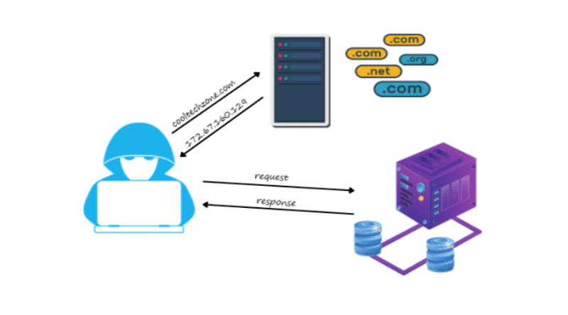
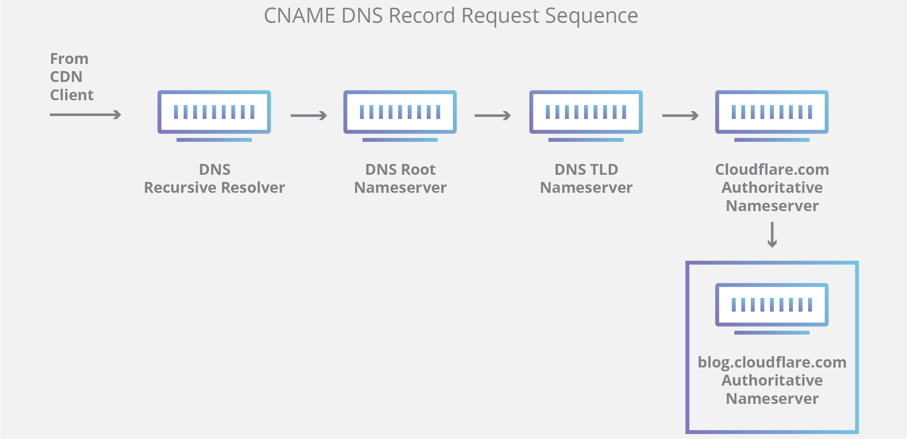

- Human generally interact with each other with names, but computers only understand numbers so to fill out that gap
  network engineers came up with a very cool concept of DNS(Learn more about it on DNS in day1.md).
- Using DNS only Clients are able to resolve the IP address of Servers.



**IP Address** is a unique identifier for a machine, just like in a college there is a unique registration number for a
student to identify him/her.

## DNS: Domain Name System ##

> ## [DNS video Tutorial](https://www.youtube.com/watch?v=mpQZVYPuDGU) ##

- It is a system which allows computers to map a domain/host name with an Ip Address because computers only understand
  Ip Address.
- DNS comes under **Application Layer Protocol**.

```
 example: 
 www.google.com === 10.10.0.12/28
```

> ### **How DNS Works:** ### 
As soon as a user types any website name in a browser (say aws.amazon.com) below steps occur:

1. Browser or Operating System checks for the IP address of amazon.com in its own cache, if it is there it returns the
   information of that IP address mapped to amazon.com.

2. If browser doesn't find the IP address of amazon.com in its own cache, it sends a request to **Resolver server(
   Resolver server is basically our Internet service Provider (ISP. example : Jio, BSNL, Airtel, VodaPhone etc.))** to
   get the IP address of amazon.com.

3. Now resolver checks its own cache memory to find out the IP Address of required request. If it finds it returns to
   browser.

4. If resolver doesn't find the IP address of required request/query, it sends a request to **Root Server** (based on
   the region nearest to user)which is top/root in the DNS hierarchy. There are **13 sets of root servers** placed in
   the world which are operated by **12 Organizations**.

|    **Hostname**    |    **IP address IPv4 / IPv6**     |            **Organization**             |
|:------------------:|:---------------------------------:|:---------------------------------------:|
| a.root-servers.net |  198.41.0.4, 2001:503:ba3e::2:30  |             VeriSign, Inc.              |
| b.root-servers.net |   199.9.14.201, 2001:500:200::b   | University of Southern California (ISI) |
| c.root-servers.net |    192.33.4.12, 2001:500:2::c     |          Cogent Communications          |
| d.root-servers.net |    199.7.91.13, 2001:500:2d::d    |         University of Maryland          |
| e.root-servers.net |  192.203.230.10, 2001:500:a8::e   |                  NASA                   |
| f.root-servers.net |    192.5.5.241, 2001:500:2f::f    |    Internet Systems Consortium, Inc.    |
| g.root-servers.net |  192.112.36.4, 2001:500:12::d0d   |     US Department of Defense (NIC)      |
| h.root-servers.net |   198.97.190.53, 2001:500:1::53   |         US Army (Research Lab)          |
| i.root-servers.net |    192.36.148.17, 2001:7fe::53    |                 Netnod                  |
| j.root-servers.net | 192.58.128.30, 2001:503:c27::2:30 |             VeriSign, Inc.              |
| k.root-servers.net |     193.0.14.129, 2001:7fd::1     |                RIPE NCC                 |
| l.root-servers.net |   199.7.83.42, 2001:500:9f::42    |                  ICANN                  |
| m.root-servers.net |    202.12.27.33, 2001:dc3::35     |              WIDE Project               |

5. Root server does not know the IP address of given request, but it knows where to send the resolver to get IP address.
   It sends resolver to **TDL (Top domain level) server**.

6. TDL server contains the information for top level domains such as **.com, .net, .org, .in. .us** etc.

7. TDL does not know the IP address of request, but it knows that for which top level domain we are asking for IP
   Address( In our case .com). Hence, it redirects resolver to **ANS (Authoritative Name Server)** telling ANS that the
   request is for (in our case .com) domain.

8. Now ANS search for the IP Address of amazon.com under .com domain and returns the actual IP address of amazon.com to
   the resolver, once it finds amazon.com, If the request is for a subdomain of amazon.com (in our case aws.amazon.com)
   , ANS searches for that subdomain under amazon.com domain and returns the IP address of aws.amazon.com.

9. ANS are responsible for getting everything related to a domain which includes IP Address as well for a zone.

10. Once the resolver receives the IP Address of amazon.com ,it returns the IP Address to browser. It is important to
    note the once the resolver receives the IP Address of amazon.com, it stores the IP address value in its own cache (
    For a certain time period (TTL: Time to live) and then removes it from cache) so that next time it will directly
    return the IP Address of amazon.com from its own cache.
11. Also, browser too stores the IP address in its own cache ( For TTL period) once it gets from Resolver so that next
    time first for same domain it doesn't need to ask Resolver again.



---

One fun exercise which you can do is, if you are on Mac or linux, type below command in terminal:

**dig "DNS Host"** ==> dig amazon.com, dig aws.amazon.com etc. It will basically return IP address of
amazon.com/aws.amazon.com (Here we are making DNS query to get IP address of domains)

dig google.com ==> 142.250.193.14