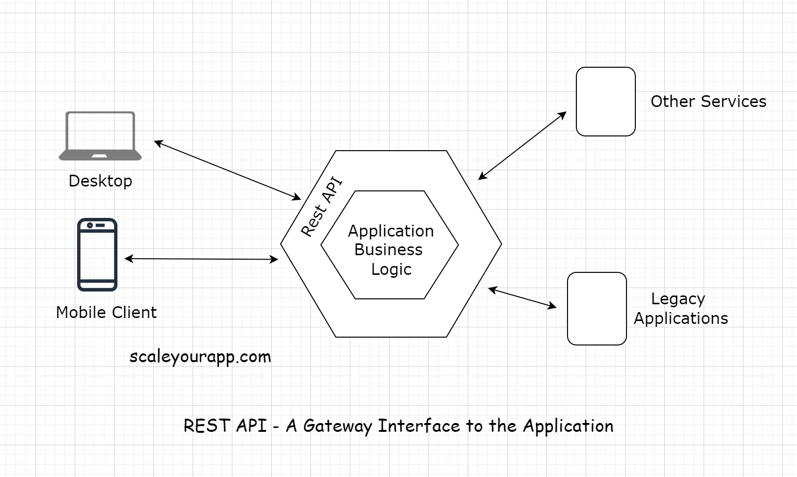

# REST #

- REST stands for Representational State Transfer. It’s a software architectural style for implementing web services.
  Web services implemented using the REST architectural style are known as the restful web services.

- A REST API is an API implementation that adheres to the REST architectural constraints. It acts as an interface. The
  communication between the client and the server happens over HTTP. A REST API takes advantage of the HTTP
  methodologies to establish communication between the client and the server. REST also enables servers to cache the
  response that improves the application’s performance.

[Rest API](../images/Rest.png)

- The communication between the client and the server are a stateless process. By that, I mean every communication
  between the client and the server are like a new one.
- There is no information or memory carried over from the previous communications. So, every time a client interacts
  with the backend, the client has to send the authentication information to it as well. This enables the backend to
  figure out whether the client is authorized to access the data or not.
- When implementing a REST API, the client communicates with the backend endpoints. This entirely decouples the backend
  and the client code.

# REST endpoint #

- An API/REST/Backend endpoint means the URL of the service that the client could hit.
  For instance, https://myservice.com/users/{username} is a backend endpoint for fetching the user details of a
  particular user from the service.
- The REST-based service will expose this URL to all its clients to fetch the user details using the above stated URL.

# Decoupling clients and the backend service #

- With the availability of the endpoints, the backend service does not have to worry about the client implementation. It
  just calls out to its multiple clients and says, “Hey Folks! Here is the URL address of the resource/information you
  need. Hit it when you need it. Any client with the required authorization to access a resource can access it”.

- With the REST implementation, developers can have different implementations for different clients, leveraging
  different technologies with separate codebase. Different clients accessing a common REST API could be a mobile
  browser, a desktop browser, a tablet or an API testing tool. Introducing new types of clients or modifying the client
  code does not affect the functionality of the backend service.

This means the clients and the backend service are decoupled.

# Application development before the REST API #

- Before the REST-based API interfaces became mainstream in the industry, we often tightly coupled the backend code with
  the client. Java Server Pages (JSP) is one example of this.

- We would always put business logic in the JSP tags. This made code refactoring and adding new features difficult
  because the business logic spread across different layers.

- Also, on the backend, we had to write separate code/classes for handling requests from different types of clients. We
  needed a separate servlet for handling requests from a mobile client and a separate one for a web-based client.

- After REST APIs implementation backend developers did not need to worry about the type of the client. All the devs had
  to do was provide the service endpoints to the clients, and they would receive the response in a standard data
  transport format like JSON. It was now the responsibility of the clients to parse and render the response data.

- This cut down a lot of unnecessary work for the backend developers. Also, adding new clients became a lot easier. Now,
  with REST, we can introduce any number of new clients without having to worry about the backend implementation.

In today’s application development landscape, there is hardly any online service implemented without a REST API. Want to
access the public data of any social network? Just use their REST API.

# API Gateway #

- The REST-API acts as a gateway or a single-entry point into the system. It encapsulates the business logic and handles
  all the client requests, taking care of the authorization, authentication, sanitizing the input data, and other
  necessary tasks before providing access to the application resources.

- So, now we are aware of the client-server architecture. We also know what a REST API is. It acts as the interface, and
  the communication between the client and the server happens over HTTP.

