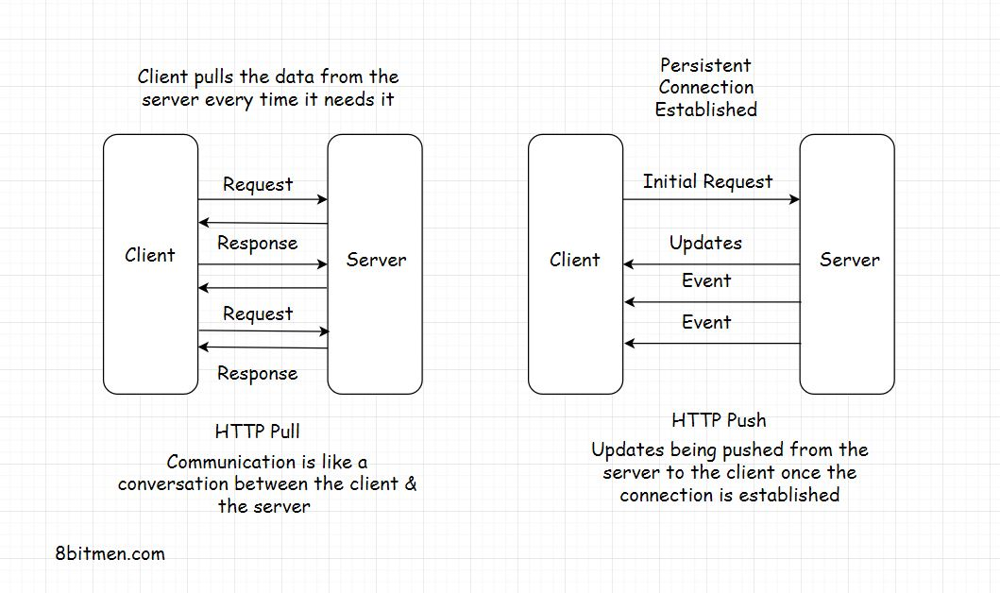

## HTTP PUSH ##

- To tackle this, we have the HTTP PUSH-based mechanism. In this mechanism, the client sends the request for certain
  information to the server just once. After the first request, the server keeps pushing the new updates to the client
  whenever they are available as long as the connection is open.
- The client does not have to worry about sending additional requests to the server for data. This saves a lot of
  network bandwidth, CPU usage and cuts down the load on the server by notches.
- The connection is closed if the either of client or server close connection. This is a stateful connection.

### Pros ###

- It is efficient as the server pushes the data to the client whenever it is available. The client does not have to
  poll the server for data.
- It is real time as the client gets the data as soon as it is available.
- There are multiple technologies involved in the HTTP PUSH-based mechanism, such as:
    - Ajax Long polling
    - Web Sockets
    - HTML5 Event Source
    - Message Queues
    - Streaming over HTTP

### Cons ###

- It is not easy to implement.
- It is stateful communication, so the server needs to know about the client and vice versa. This makes it difficult
  to scale.
- There is a lot of memory consumption as the server needs to keep track of all the clients and their connections.

---

# Time to Live (TTL) #

- In the regular client-server communication, which is HTTP PULL, there is a Time to Live (TTL) for every request. It
  could be 30 secs to 60 secs, varying from browser to browser.
- If the client does not receive a response from the server within the TTL, the browser kills the connection and the
  client has to re-send the request hoping it receives the data from the server before the TTL ends again.
- Open connections consume resources, and there is a limit to the number of open connections a server can handle at one
  point. If the connections don’t close and new ones are introduced regularly over time, the server will run out of
  memory. Hence, the TTL is used in client-server communication. But what if we are certain that the response will take
  more time than the TTL set by the browser?

# Persistent connection #

In this case, we need a persistent connection between the client and the server. A persistent connection is a network
connection between the client and the server that remains open for future requests and responses, as opposed to being
closed after a single communication. This facilitates HTTP PUSH-based communication between the client and the server.

# Heartbeat interceptors #

- Now you might wonder how a persistent connection is possible if the browser kills the open connections to the server
  every x seconds? The connection between the client and the server stays open with the help of Heartbeat Interceptors.
- These are just blank request responses between the client and the server to prevent the browser from killing the
  connection. Isn’t this resource-intensive?

# Resource intensive #

- Yes, it is. Persistent connections consume a lot of resources compared to the HTTP PULL behavior. However, there are
  use cases where establishing a persistent connection is vital to an application’s feature.
- For instance, a browser-based multiplayer game has a pretty large amount of request-response activity within a limited
  time than a regular web application.
- It would be apt to establish a persistent connection between the client and the server in this use case from a user
  experience standpoint.

---

Long opened connections can be implemented by multiple techniques such as AJAX Long Polling, Web Sockets, Server-Sent
Events, etc.

### Web Sockets ###

- Web Sockets is a protocol that enables full-duplex communication between the client and the server. It is a
  bidirectional communication channel that allows the server to push data to the client whenever it is available.
- Typical use-cases of web sockets are messaging, chat applications, real-time social streams, browser-based massive
  multiplayer games, etc. These are apps with quite a significant number of read writes compared to a regular web app.
- With web sockets, we can keep the client-server connection open as long as we want.
- Have **bidirectional** data? Go ahead with web sockets. One more thing, web sockets don’t work over HTTP. The
  mechanism runs over TCP. Also, the server and the client should both support web sockets. Else it won’t work.