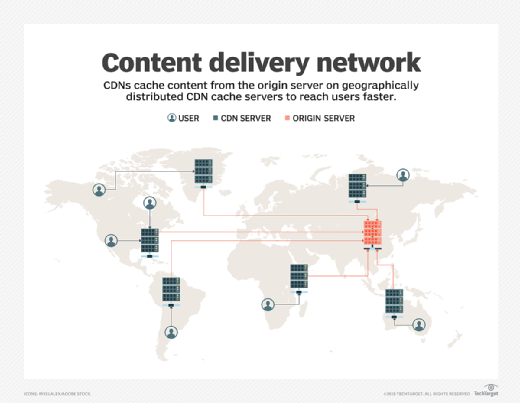

## Content Delivery Network ##

- A content delivery network (CDN) refers to a geographically distributed group of servers which work together to
  deliver fast, efficient and secure delivery of content to websites and Internet services.

- A CDN allows for the quick transfer of assets needed for loading Internet content including HTML pages, javascript
  files, stylesheets, images, and videos. The popularity of CDN services continues to grow, and today the majority of
  web traffic is served through CDNs, including traffic from major sites like Facebook, Netflix, and Amazon.

- A properly configured CDN may also help protect websites against some common malicious attacks, such as Distributed
  Denial of Service (DDOS) attacks.

- While a CDN does not host content and can’t replace the need for proper web hosting, it does help cache content at the
  network edge, which improves website performance. Many websites struggle to have their performance needs met by
  traditional hosting services, which is why they opt for CDNs.

By utilizing caching to reduce hosting bandwidth, helping to prevent interruptions in service, and improving security,
CDNs are a popular choice to relieve some major pain points that come with traditional web hosting.

## CDN Benefits ##

1. **Improving website load times** - By distributing content closer to website visitors by using a nearby CDN server (
   among other optimizations), visitors experience faster page loading times. As visitors are more inclined to click
   away from a slow-loading site, a CDN can reduce bounce rates and increase the amount of time that people spend on the
   site. In other words, a faster a website means more visitors will stay and stick around longer. CDNs can reduce the
   amount of data that’s transferred by reducing file sizes using tactics such as minification and file compression(you
   see those ***.min.js** files, right? Those are minimized and compressed files).
   Smaller file sizes mean quicker load times.
2. **Reducing bandwidth costs** - Bandwidth consumption costs for website hosting is a primary expense for websites.
   Through caching and other optimizations, CDNs are able to reduce the amount of data an origin server must provide,
   thus reducing hosting costs for website owners.
3. **Increasing content availability and redundancy** - Large amounts of traffic or hardware failures can interrupt
   normal website function. Thanks to their distributed nature, a CDN can handle more traffic and withstand hardware
   failure better than many origin servers. It checks whether the server nearest to you is up and running or not, if
   not, it redirects the request to next nearest server and so on. This way, the user gets the content from the nearest
   server and the load on the origin server is reduced (This is called **failover** and done via **Anycast routing**).
4. **Improving website security** - A CDN may improve security by providing DDoS mitigation, improvements to security
   certificates, and other optimizations.

## Reliability and Redundancy - How does a CDN keep a website always online? ##

Uptime is a critical component for anyone with an Internet property. Hardware failures and spikes in traffic, as a
result of either malicious attacks or just a boost in popularity, have the potential to bring down a web server and
prevent users from accessing a site or service. A well-rounded CDN has several features that will minimize downtime:

Load balancing distributes network traffic evenly across several servers, making it easier to scale rapid boosts in
traffic.
**Intelligent failover** provides uninterrupted service even if one or more of the CDN servers go offline due to
hardware malfunction; the failover can redistribute the traffic to other nearest operational servers.
In the event that an entire data center is having technical issues, Anycast routing transfers the traffic to another
nearest available data center, ensuring that no users lose access to the website.

----

## Anycast ##

- Anycast is a routing technology that allows a single IP address to be used for multiple servers. In context of CDN,
  Anycast typically routes the user request to the nearest server that has the resource available and enables our
  website to be resilient in the face of high traffic volume, network congestion, and DDoS attacks. This is accomplished
  by using a routing algorithm that determines the best server to send the request to, based on the location of the user
  and the location of the servers.

## How does an Anycast network mitigate a DDoS attack? ##

After other DDoS mitigation tools filter out some attack traffic, Anycast distributes the remaining attack
traffic across multiple data centers, preventing any one location from becoming overwhelmed with requests. If the
capacity of the Anycast network is greater than the attack traffic, the attack is effectively mitigated. In most DDoS
attacks, many compromised "zombie" or “bot” computers are used to form what is known as a botnet. These machines can be
scattered around the web and generate so much traffic that they can overwhelm a typical Unicast-connected machine.

A properly Anycasted CDN increases the surface area of the receiving network so that the unfiltered denial-of-service
traffic from a distributed botnet will be absorbed by each of the CDN’s data centers. As a result, as a network
continues to grow in size and capacity it becomes harder and harder to launch an effective DDoS against anyone using the
CDN.

It is not easy to set up a true Anycasted network. Proper implementation requires that a CDN provider maintains their
own network hardware, builds direct relationships with their upstream carriers, and tunes their networking routes to
ensure traffic doesn't "flap" between multiple locations.