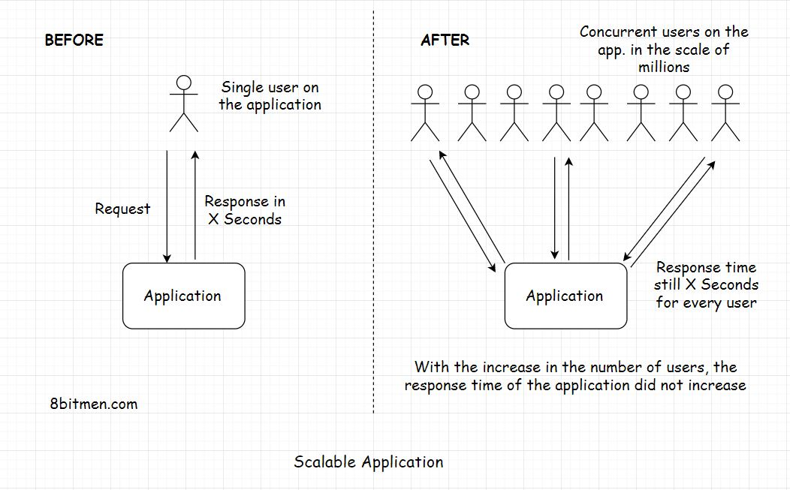

# Scalability #

Scalability means the application’s ability to handle and withstand increased workload without sacrificing performance.
For example, if your app takes x seconds to respond to a user request. It should take the same x seconds to respond to
each of your app’s million concurrent user requests.
The app’s back-end infrastructure should not crumble under a load of a million concurrent requests. It should scale well
when subjected to a heavy traffic load and maintain the system’s latency.

## What is latency ##

Latency is the time a system takes to respond to a user request. Let’s say you send a request to an app to fetch an
image and the system takes 2 seconds to respond to your request. The latency of the system is 2 seconds. Minimum latency
is what efficient software systems strive for. No matter how much the traffic load on a system builds up, the latency
should not go up. This is what scalability is. If the latency remains the same, we can say that the application scaled
well with the increased load and is highly scalable.

Let’s see scalability in terms of Big-O notation. Ideally, the complexity of a system or an algorithm should be O(1)
which is constant time like in a map or a key-value database(But that is not possible in real life).

A program with the complexity of O(n^2) where n is the size of the data set is not scalable. As the size of the data set
increases, the system will need more computational power and other resources to process the tasks.

# Measuring latency #

Latency is measured as the time difference between the action that a user takes on the website and the system’s response
in reaction to that action. The action can be an event like clicking a button, scrolling down a web page, etc.
This latency is generally divided into two parts:

1. **Network latency** : Network latency is the time that the network takes to send a data packet from point A to point
   B. The network should be efficient enough to handle the increased traffic load on the website. To cut down the
   network latency, businesses use a CDN (Content Delivery Network) to deploy their servers across the globe as close to
   the end-user as possible. These close to the user locations are also known as Edge locations.
2. **Application latency** : Application latency is the time the application takes to process a user request. There are
   more than a few ways to cut down the application latency. The first step is to run stress and load tests on the
   application and scan for the bottlenecks that slow down the system as a whole. I’ll talk more about it in the
   upcoming lessons.

## Why is low latency so crucial for online services? ##

Latency plays a significant role in determining if an online business wins or loses a customer. Nobody likes to wait for
a response on a website.
If the visitor gets the response within a stipulated time, great otherwise, they’ll bounce off to another website. There
is ample market research that concludes high latency in applications is a big factor in customers bouncing off a
website. If there is money involved, zero latency is what businesses want(Iff this was possible😀😀).

Think of massive multiplayer online (MMO) games. A slight lag in an in-game event ruins the whole experience. A gamer
with a high latency internet connection will have a slow response time despite having the best reaction time of all the
players in an arena.

Algorithmic trading services need to process events within milliseconds. Fintech companies have dedicated networks to
run low latency trading. The regular network just won’t cut it.

We can realize the importance of low latency by the fact that in 2011 Huawei and Hibernia Atlantic started laying a
fiber-optic link cable across the Atlantic Ocean between London and New York. This property was estimated to cost
approximately $300M just to save traders six milliseconds of latency.