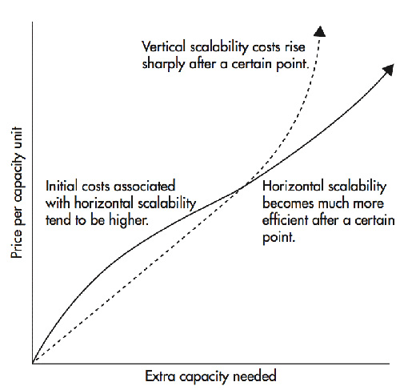

Over the time as number of users in our application increases, the most important thing for you is to provide services
to all users at the same time and for that we need to scale our system according to the usage. There are basically 2
ways to scale your software:

- Horizontal Scaling
- Vertical Scaling

---

|                                                                                                                                                                                         Horizontal Scaling                                                                                                                                                                                         |                                                                                                                Vertical Scaling                                                                                                                 |
|:--------------------------------------------------------------------------------------------------------------------------------------------------------------------------------------------------------------------------------------------------------------------------------------------------------------------------------------------------------------------------------------------------:|:-----------------------------------------------------------------------------------------------------------------------------------------------------------------------------------------------------------------------------------------------:|
|                                                                                                                                                                                        Adding more machines                                                                                                                                                                                        |                                                                                                       Adding more power to single machine                                                                                                       |
|                                                                                                                                                                                           [] [] [] [] []                                                                                                                                                                                           |                                                                                                                    [      ]                                                                                                                     | 
|                                                                                                                              Load balancing is required so that we can properly use all machine equally and redirect requests to other machines in case of high load.                                                                                                                              |                                                                                                                       N/A                                                                                                                       |
|                                                                                                                                                Resilient(Meaning if one machine fails, control goes to other machine to handle requests of clients)                                                                                                                                                |                                                                                                 Single Point of failure as it is single machine                                                                                                 |
|                                                                                                                                               Slow because Network Calls (As machines are different, they talk to each other on a network protocol)                                                                                                                                                |                                                                                        Fast as Single Machine, there will be inter process Communication                                                                                        | 
|                                                                                                                                                                                            Scales well                                                                                                                                                                                             |                                                                                        Hardware limit (As we can't have a infinite large single machine)                                                                                        |
| Data inconsistency(Since we are passing information from 1 machine to other so we are not sure whether <br/we will get consistent data or not. There can be inconsistency in cache (Dirty read/write). For example let's say we are performing an atomic operation, in that case we have to lock all machine to ensure that everything is successful or rollback (Which is practically impossible) |                                                                                                  Data is consistent as we have single machine                                                                                                   |
|                                                                                            Although it is more costly in the beginning but It is much cheaper over the time as the usage increases, because adding more spec to same machine is more costly than adding new machine with current spec.                                                                                             | Although it is cheaper in the beginning but It is more costly as the time passes and we keep on increasing spec over the time and at a point, it becomes almost impossible to add more specs to a single machine as we reach to MAX CPU, Memory |

---

---

In real life scenario, we basically use combination of both (Hybrid Scaling==> Although we call it horizontal scaling)

- Data Consistency
- Resilient
- Load Balancing
- Inter Process Communication (Fast)

---

## Some more points to consider ##

- Ideally, when the traffic starts to build on the app, the first step should be to scale vertically as it does not
  require any code refactoring or the need to make any complex configurations
  and so on ( I’ll discuss in the next lesson why code refactoring is needed when we horizontally scale our app.).
  Vertical scaling is also called scaling up.
- However, there is only so much we can do when scaling vertically. There is a limit to the compute power we can augment
  for a single server.
- A good analogy would be to think of a multi-story building. We can keep adding floors to it but only up to a certain
  point. What if the number of people in need of a flat keeps rising? We can’t scale the building up to the moon for
  obvious reasons. Now is the time to build more buildings. This is where horizontal scalability comes in.
- When the traffic is too large to be handled by a single server, we bring in more servers to work together.
- Horizontal scaling also allows us to scale dynamically in real-time as the traffic on our website climbs and drops
  over a period of time. Dynamic scaling is not possible when scaling vertically.

## Cloud elasticity ##

- The most prominent reason cloud computing became mainstream in the industry is the ability of the cloud to scale
  dynamically. In case of the traffic climb, the cloud adds additional servers to the hardware resource pool and when it
  drops, the servers added are removed.

- The ability to use and pay only for the hardware resources used by the website got popular with businesses for obvious
  economic reasons.

- The process of adding and removing servers, stretching and returning to the original infrastructural computational
  capacity, on the fly is popularly known as cloud elasticity. It saves businesses truckloads of money every single day.

- Having multiple server nodes on the backend also helps the website stay online even if a few server nodes crash. This
  is known as high availability.

## Why does the code need to change when it has to run on multiple machines? ##

- If you intend to run the code in a distributed environment, it needs to be stateless. There should be no state in the
  code.

## Which scalability approach is right for our app? ##

- Always have a ballpark estimate in mind when designing your app. How much traffic will it have to deal with?
  Today, development teams are adopting a distributed microservices architecture right from the start, and workloads (
  applications) are meant to be deployed on the cloud. So, inherently the workloads are horizontally scaled out on the
  fly.
- The upsides of horizontal scaling include no limit to augmenting the hardware capacity. Data is replicated across
  different geographical regions as nodes and data centers are set up across the globe.

- If your app is a utility or tool expected to receive minimal predictable traffic. For instance, an internal tool of an
  organization or something similar that is not mission-critical. Why bother hosting it in a distributed environment? A
  single server is enough to manage the traffic, so go ahead with vertical scaling when we know that the traffic load
  will not spike in the future.

- If your app is a public-facing social app like a social network, a fitness app, an online game, or something similar,
  where the traffic is unpredictable. Both high availability and horizontal scalability are important to you. Build
  these apps to deploy them on the cloud, and always have horizontal scalability in mind right from the start.