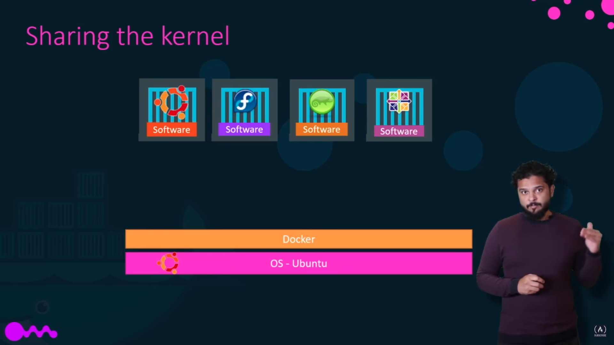

[Install Docker](https://www.digitalocean.com/community/tutorials/how-to-install-and-use-docker-on-ubuntu-20-04)

## Docker ## 

- Docker software is a tool for building and running applications in containers. It is a containerization engine that
  allows you to run applications in a virtual machine.
- It's one time pain, once you have dockerized your application, you can run it on any machine, and It is guaranteed to
  run on any machine.
- Docker Client is a command line interface which is used to talk to Docker daemon(server which runs on your host OS)
  using some predefined valid scripts.

```bash
 docker container ls, docker --version, docker info, docker ps etc.
```

- Whenever you try to run a docker container, firstly docker checks whether image is present in local or not, if not it
  will fetch that image from **docker hub** and cache it in local so that in future if request for same object comes, it
  will fetch that from local and run it.
- docker hub is a place where all images are stored. You can also push your own image to docker hub and others can pull
  it.

--- 
> ### Image vs Container ### 

- Image is a file that contain instructions for building a container. Basically it tells us what should run inside a
  container. Generally we use a file name **Dockerfile** for this.
- Container is a virtual machine that runs an image.

```
For a simple analogy, think of a Docker image as the recipe for a cake, and a container as a cake you baked from it.
```

## Container ## 

- Containers are like isolated rooms which have their own environment. They are like a box that you can put stuff in,
  but they share same kernel (like linux kernel, Windows kernel etc.).
- Think of this case:
  We have different linux distributions like Ubuntu, fedora, centos etc. but they are all based on same kernel which is
  linux, it is just the software running on top of that kernel which makes them look like different. So we can say that
  they are all containers.
  

---

- But one more thing to note is, we can't run a container of different distribution on same kernel. Meaning, we can't
  run windows based containers on linux kernel which is obvious because for windows based containers kernel would be
  different from linux.
- Now many people can argue that hey we are able to run linux based containers on Windows but that is not the case
  because under the hood windows runs those linux docker containers on a virtual machine based on linux kernel.

- Once the web service/software running inside container stops or crashes, the container stops as well.