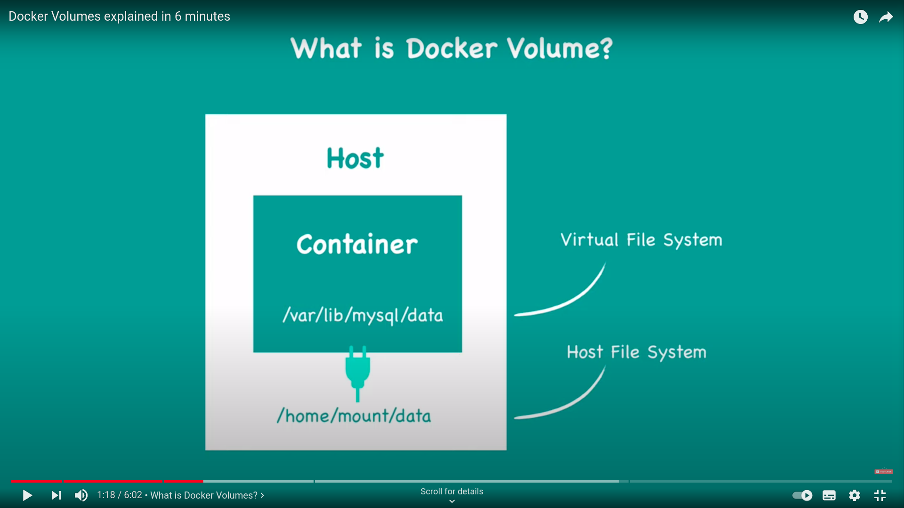

## Docker Volume ##

- Docker volume is used for data persistent. It is a directory that is created on host Operating System and is shared
  with container.
- Containers are isolated from each other, but they share the same filesystem.
- Say you are using a database container(obviously containers run on HOST OS) which will have virtual file system to
  perform CRUD operations on data.
- Once we stop, restart or remove container, all the data will be gone, but this is not what we want, we want our
  changes to reflect in our database all the time. For this purpose we use docker volumes.

--- 

> ### How docker volumes works with container ## 

- In our OS, we have a physical file system, right. Now as we have a container, we have a virtual file system as well.
- So what we do it, we plug our physical file path(it could be file or folder) to the container's virtual file path so
  that once we make changes in container's virtual file, data changed is automatically reflected in physical file of OS
  and vice-versa.
- **You can consider that physical file path as docker volume which is mounted to virtual file system of container**.
- Hence, even though we remove or stop container: changes and data will be there.
  
- Hence, we can use docker volumes to persist data. One more thing is to notice that once we remove docker container,
  docker volume associated with it won't be removed automatically. We need to remove it manually to free disk space.