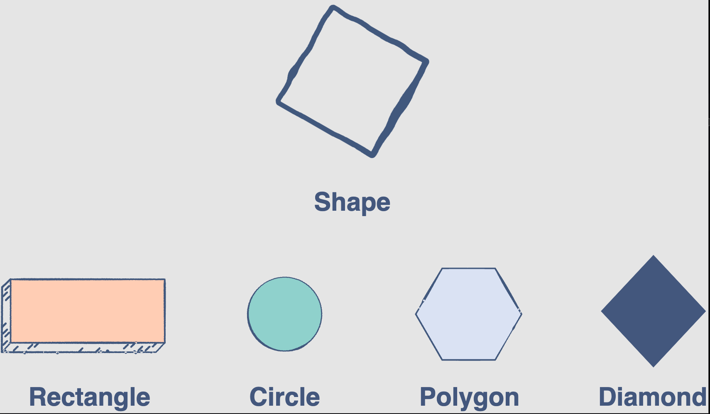

## Polymorphism ##

In programming, polymorphism refers to the same object exhibiting different forms and behaviors.
For example, take the Shape Class. The exact shape you choose can be anything. It can be a rectangle, a circle, a
polygon, or a diamond. While, these are all shapes, their properties are different. This is called polymorphism.



**What does polymorphism achieve?**
In effect, polymorphism cuts down the work of the developer. When the time comes to create more specific subclasses with
certain unique attributes and behaviors, the developer can alter the code in the specific areas where the responses
differ. All other pieces of the code can be left untouched.

---

## Method Overriding ##

Method overriding is the process of redefining a parent class’s method in a subclass.

### Advantages and key features of method overriding ###

- The derived classes can give their own specific implementations to inherited methods without modifying the parent
  class methods.
- For any method, a child class can use the implementation in the parent class or make its own implementation.
- Method overriding needs inheritance, and there should be at least one derived class to implement it.
- The methods in the derived classes usually have a dissimilar implementation.

---

### Overloading operators in Python ###

Operators in Python can be overloaded to operate in a certain user-defined way. Whenever an operator is used in Python,
its corresponding method is invoked to perform its predefined function. For example, when the +, - operator is called,
it invokes the special function, __add__, __sub__ respectively in Python, but this operator acts differently for
different data types. For example, the + operator adds the numbers when it is used between two int data types and merges
two strings when it is used between string data types.

```python
print(1 + 2)
print("Taslim" + "Arif")


class Overload:
    def __init__(self, real=0, imaginary=0):
        self.real = real
        self.imaginary = imaginary

    def __add__(self, other):
        return Overload(self.real + other.real, self.imaginary + other.imaginary)

    def __sub__(self, other):
        return Overload(self.real + other.real, self.imaginary + other.imaginary)


obj1 = Overload(1, 2)
obj2 = Overload(2, 5)

print(obj1 + obj2)
print(obj1 - obj2)
```

---

## Abstract Base Class ##

- Abstract base classes define a set of methods and properties that a class must implement in order to be considered a
  duck-type instance of that class.
- Note: Methods with **@abstractmethod** decorators must be defined in the child class.
- By using abstract base classes, we can control classes whose objects can or cannot be created.
- Abstract methods must be defined in child classes for proper implementation of inheritance.
- To define an abstract base class, we use the abc module. The abstract base class is inherited from the built-in
  **ABC** class. We have to use the decorator **@abstractmethod** above the method that we want to declare as an
  abstract method.

```python
from abc import ABC, abstractmethod


class Shape(ABC):  # Shape is a child class of ABC
    @abstractmethod
    def area(self):
        pass

    @abstractmethod
    def perimeter(self):
        pass


class Square(Shape):
    def __init__(self, length):
        self.length = length

    def area(self):
        return self.length * self.length

    def perimeter(self):
        return self.length * 2


shape = Shape()  # This will not compile as Square must implement all abstract methods of Shape class.
```
